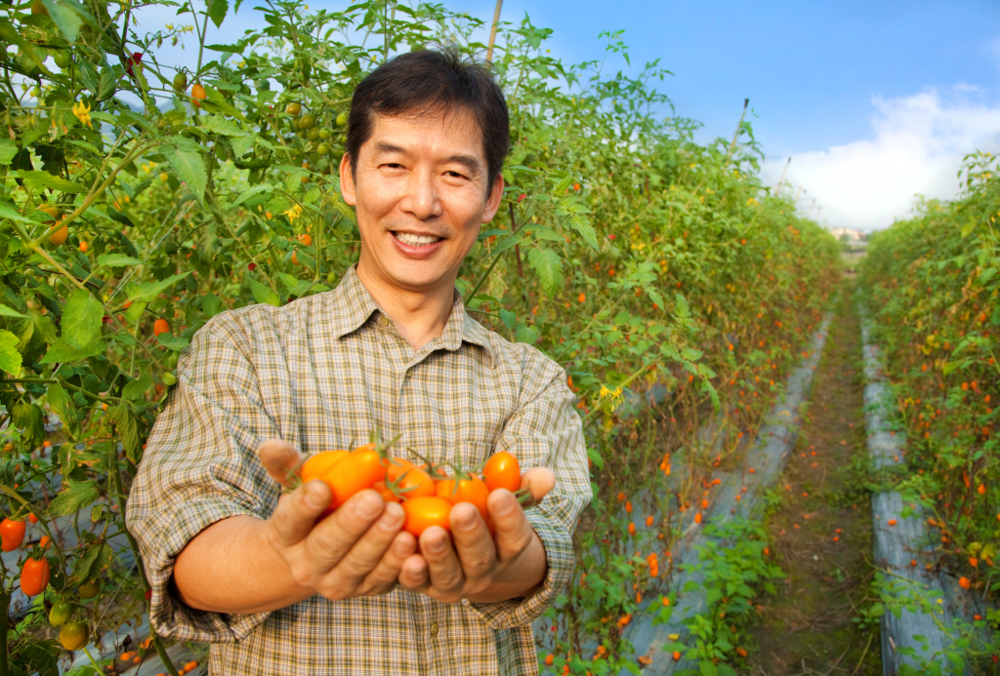
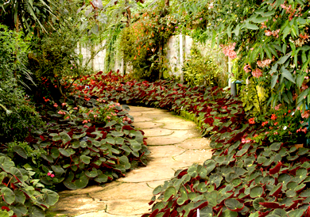
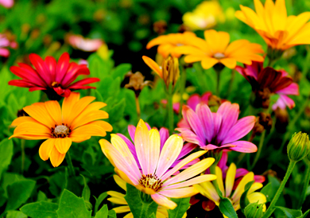
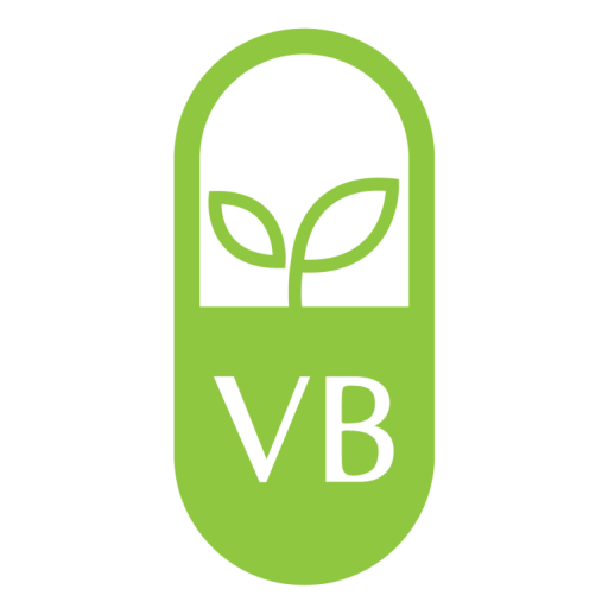

It's Time For You To Have​

# The Garden Of Your Dreams​

Gardenterprise is your one-stop shop for everything gardening-related. We'll teach you how to cultivate and care for your crops. Our blog is packed with information on everything from planting to harvesting. We have tips and advice from experts in the field to get the most out of your garden.

What You'll Learn

## Meet Nature Halfway​

[View All Articles](/blog)

01.

#### Design & Planting​

Don't just read about gardening, get out there and do it! Our tutorials will show you how to plant, prune, and care for your garden like a pro. Learn from our mistakes, and avoid them in your own garden.

[Read More](https://garden.gnmnetworks.com/category/design-planting/)

02.

#### Garden Care​

Gardening is a hands-on activity that allows you to get up close and personal with your plants. Experience the joy of watching them grow and flourish under your care. With our help, you can keep your plants alive and thriving.

[Read More](https://garden.gnmnetworks.com/category/garden-care/)

03.

#### Irrigation & Drainage​

Gardening is not only a fun activity, but it also has a host of benefits for your mental & physical health. From reducing stress to improving your cardiovascular health, gardening has something to offer everyone.

[Read More](https://garden.gnmnetworks.com/category/irrigation/)

What Sets Us Apart from Other Gardening Blogs?

## A Few Words About Us​

**We've been gardening for years, and we've learned a lot along the way. We want to share our knowledge with our readers, and we also want to hear from them. We want to create a community of gardeners who can help and support each other.**  
  
If you're just starting out, or if you're struggling with your garden, we want you to know that you're not alone. We're here to help, and we hope that you'll join us on this journey.

[Read More](https://garden.gnmnetworks.com/about-us/)

This Is Why​

## You Should Read Our Content

Some Of Our​

### Recent Projects​

We started our gardening journey by learning as much as we could about gardening. We read gardening blogs, took gardening classes, and talked to experts in the field. We also grew a lot of plants, both in our garden and in containers. We learned a lot along the way and we want to share our knowledge with you.

[Read More](https://garden.gnmnetworks.com/about-us/)

###### Featured Brands:

