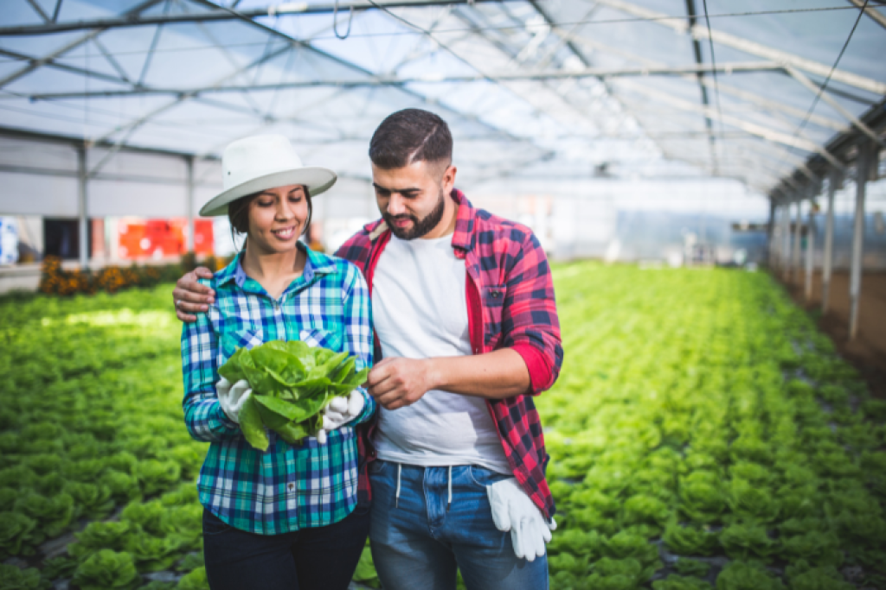

# Know More About The Awarded Gardening Blog

We're passionate about gardening and helping beginners to better care for their plants. We want to share our knowledge with as many people as possible, and we hope that our website will help people to have beautiful gardens that they can be proud of.

## About Us

When my wife and I first moved into our home, we were excited to start planting vegetables and flowers in our backyard. We had no idea where to start, so we did some research and started learning about gardening. We read books, took classes at the local garden center, and joined a gardening forum online. We soon found out that we loved gardening, and we started sharing our knowledge with others by writing blog posts and articles about gardening.

We're passionate about gardening and helping beginners to better care for their plants. We want to share our knowledge with as many people as possible, and we hope that our website will help people to have beautiful gardens that they can be proud of.

[

Contact us Now

](https://garden.gnmnetworks.com/contact-us/)

#### Our Vision

When we started Gardenterprise, we had a simple vision: to help beginners learn about gardening and to care for their plants better. We're a website that's dedicated to giving people the tools they need to be successful gardeners.  
  
We've come a long way since we first started out. We've learned a lot about gardening, and we've grown as a team. We're passionate about helping beginners, and we want to share our knowledge with as many people as possible.  
  
We hope that Gardenterprise will become your go-to source for all things gardening. We want to help you care for your plants, and we want to make gardening fun and rewarding for you. Thanks for joining us on this journey!

#### Our Mission

When we started out on this gardening journey, we were like beginners ourselves. We had no idea what to do, where to start, or how to care for our plants. But we learned. We grew. And we want to help others do the same.  
  
That's why we created this website—to provide beginners with all the information they need to get started in gardening and to help them care for their plants in the best way possible. We want to make gardening accessible to everyone, regardless of experience or expertise.  
  
We know that gardening can be a lot of work, but it's so worth it when you see those beautiful plants blooming in your garden. We hope that our website can help make your gardening journey a little bit easier and a lot more enjoyable.

#### Core Values

When we started out on this gardening journey, we were just beginners ourselves. We had no idea what we were doing, but we were eager to learn. And that's what drove us to create this website—to help beginners care for their plants better and to teach them everything we've learned along the way.  
  
We believe that gardening is a skill that can be learned by anyone, and we're passionate about sharing our knowledge with others. We want to help people feel confident in their ability to grow plants, and we want to inspire them to see the beauty of nature all around them.  
  
We're dedicated to providing quality information and resources for gardeners of all levels, and we're always updating our content to reflect the latest trends and discoveries in the gardening world. We hope you'll stick around and join us on this wonderful gardening journey!
